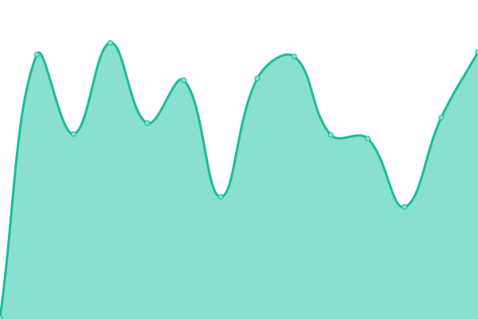
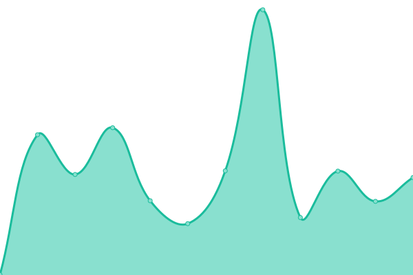
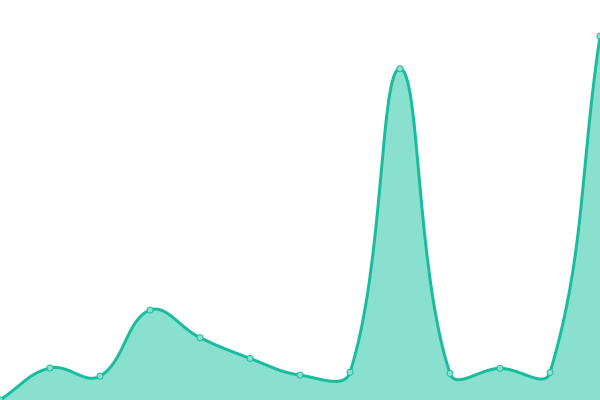
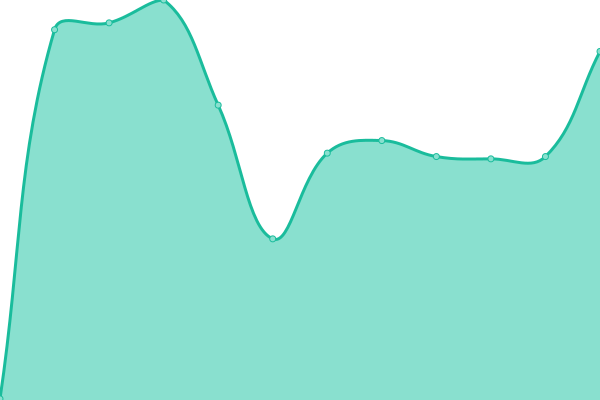
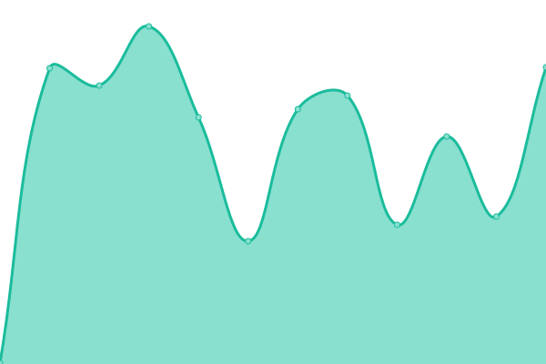
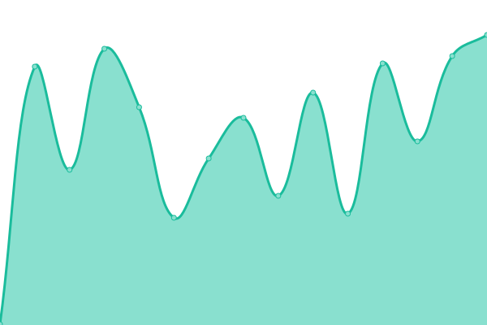
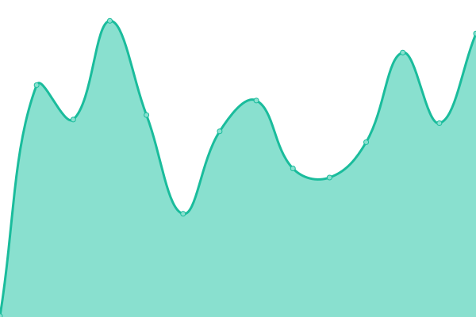

# [📈 Live Status](https://status.smilowitz.com): <!--live status--> **🟧 Partial outage**

This repository contains the open-source uptime monitor and status page for [shrage](https://status.smilowitz.com), powered by [Upptime](https://github.com/upptime/upptime).

With [Upptime](https://upptime.js.org), you can get your own unlimited and free uptime monitor and status page, powered entirely by a GitHub repository. We use [Issues](https://github.com/shrage/status/issues) as incident reports, [Actions](https://github.com/shrage/status/actions) as uptime monitors, and [Pages](https://status.smilowitz.com) for the status page.

<!--start: status pages-->
<!-- This summary is generated by Upptime (https://github.com/upptime/upptime) -->
<!-- Do not edit this manually, your changes will be overwritten -->
<!-- prettier-ignore -->
| URL | Status | History | Response Time | Uptime |
| --- | ------ | ------- | ------------- | ------ |
|  [Smilowitz](https://smilowitz.com) | 🟩 Up | [smilowitz.yml](https://github.com/shrage/status/commits/HEAD/history/smilowitz.yml) | 

 255ms
     
 | 

<a href="https://status.smilowitz.com/history/smilowitz">91.74%</a>
    

|  [One Team Forward](https://oneteamforward.com) | 🟩 Up | [one-team-forward.yml](https://github.com/shrage/status/commits/HEAD/history/one-team-forward.yml) | 

 378ms
     
 | 

<a href="https://status.smilowitz.com/history/one-team-forward">100.00%</a>
    

|  [Atavya Ready](https://app.atavya.com/readyz) | 🟩 Up | [atavya-ready.yml](https://github.com/shrage/status/commits/HEAD/history/atavya-ready.yml) | 

 520ms
     
 | 

<a href="https://status.smilowitz.com/history/atavya-ready">100.00%</a>
    

|  [CashflowGeni Ready](https://cashflowgeni.com/readyz) | 🟩 Up | [cashflow-geni-ready.yml](https://github.com/shrage/status/commits/HEAD/history/cashflow-geni-ready.yml) | 

 316ms
     
 | 

<a href="https://status.smilowitz.com/history/cashflow-geni-ready">100.00%</a>
    

|  [Ploiny API Ready](https://ploiny.com/api/readyz) | 🟩 Up | [ploiny-api-ready.yml](https://github.com/shrage/status/commits/HEAD/history/ploiny-api-ready.yml) | 

 318ms
     
 | 

<a href="https://status.smilowitz.com/history/ploiny-api-ready">100.00%</a>
    

|  [Markdown Bubble](https://markdownbubble.com) | 🟩 Up | [markdown-bubble.yml](https://github.com/shrage/status/commits/HEAD/history/markdown-bubble.yml) | 

 279ms
     
 | 

<a href="https://status.smilowitz.com/history/markdown-bubble">100.00%</a>
    

|  [Wheel of Communication](https://wheelofcommunication.com) | 🟩 Up | [wheel-of-communication.yml](https://github.com/shrage/status/commits/HEAD/history/wheel-of-communication.yml) | 

 256ms
     
 | 

<a href="https://status.smilowitz.com/history/wheel-of-communication">100.00%</a>
    

|  [Notification Email Test](https://httpstat.us/503) | 🟥 Down | [notification-email-test.yml](https://github.com/shrage/status/commits/HEAD/history/notification-email-test.yml) | 

 0ms
     
 | 

<a href="https://status.smilowitz.com/history/notification-email-test">14.11%</a>
    

<!--end: status pages-->

[**Visit our status website →**](https://status.smilowitz.com)

## 📄 License

- Powered by: [Upptime](https://github.com/upptime/upptime)
- Code: [MIT](./LICENSE) © [Anand Chowdhary](https://anandchowdhary.com), supported by [Pabio](https://pabio.com)
- Data in the `./history` directory: [Open Database License](https://opendatacommons.org/licenses/odbl/1-0/)
